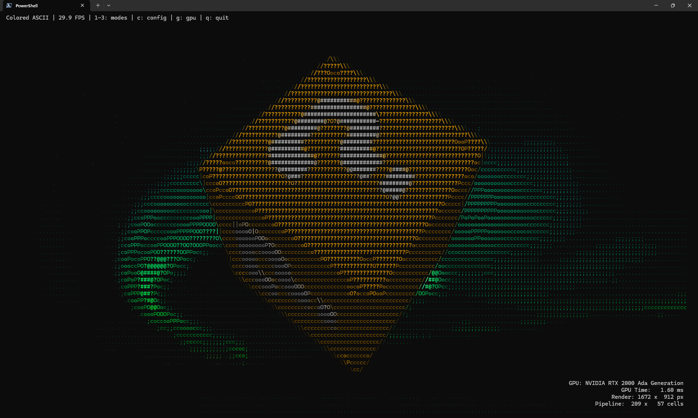

# ASCII 3D Terminal Demo

A proof-of-concept demonstrating real-time 3D rendering directly to a terminal as ASCII art. This project renders a 3D scene using GPU shaders, then converts the output to various terminal-displayable formats via a compute shader pipeline.

**This is a technology demonstration, I would not use this in any production application/game as-is.** It exists to explore the feasibility of building a visually rich terminal application (this is a indie game waiting to happen) with a proper 3D environment.



## Credits

This project is heavily inspired by and based on the incredible work of **[Acerola](https://www.youtube.com/@Acerola_t)**. The ASCII shader pipeline, edge detection approach, and character mapping techniques are adapted from their AcerolaFX shader suite.

**Watch the original video explaining this technique:**
[https://www.youtube.com/watch?v=gg40RWiaHRY](https://www.youtube.com/watch?v=gg40RWiaHRY)

## How It Works

1. **GPU 3D Rendering**: A full 3D scene is rendered to an off-screen texture using wgpu with standard vertex/fragment shaders, including lighting and optional skybox backgrounds.

2. **Edge Detection Pipeline**: A multi-pass compute shader pipeline processes the rendered image:
   - Gaussian blur for noise reduction
   - Difference of Gaussians (DoG) for edge detection
   - Sobel operators for edge direction classification
   - Depth and normal-based edge enhancement

3. **ASCII Conversion**: Each cell of the terminal is mapped to either:
   - A **fill character** based on luminance (` .;coPO?@#` from dark to bright)
   - An **edge character** based on detected edge direction (`| - / \`)

4. **Terminal Output**: The final ASCII art is rendered using:
   - Plain ASCII (luminance only)
   - Colored ASCII (24-bit ANSI true color)
   - Half-block mode (`▀` with fg/bg colors for 2x vertical resolution)

## Controls

| Key | Action |
|-----|--------|
| `W/A/S/D` | Rotate model (thruster-style with momentum) |
| `Q/E` | Zoom out/in |
| `R` | Reset to auto-rotation mode |
| `1/2/3` | Switch render mode (Plain/Colored/Half-block) |
| `Tab` | Cycle render modes |
| `G` | Toggle GPU info overlay |
| `C` | Open configuration menu |
| `F` | Copy current frame to clipboard (with ANSI codes) |
| `Esc` | Quit |

## Configuration

Press `C` to open the configuration menu where you can:
- Select different 3D models (OBJ, glTF, GLB formats supported)
- Choose rotation mode (Static, Axis X/Y/Z, Tumble, Orbit)
- Adjust rotation speed
- Select lighting mode (Flat, Diffuse, Specular, Toon, Gradient, Normals)
- Load skybox backgrounds

## Building

Requires Rust 1.70+ and a GPU with Vulkan, Metal, or DX12 support.

```bash
cargo build --release
```

The binary will be at `target/release/ascii-3d` (or `ascii-3d.exe` on Windows).

## Adding Models

Place 3D model files in `assets/models/`. (Mostly) supported formats:
- Wavefront OBJ (`.obj`)
- glTF (`.gltf`)
- GLB (`.glb`)

Textures have a tendency to be wonky. Keep objects simple for best results.

## Adding Skyboxes

Place image files in `assets/skyboxes/`. Supported formats:
- JPEG (`.jpg`, `.jpeg`)
- PNG (`.png`)
- BMP (`.bmp`)

## Project Structure

```
src/
├── terminal_main.rs     # Main application entry point
├── gpu/
│   ├── headless.rs      # Off-screen GPU rendering
│   └── pipeline.rs      # ASCII compute shader pipeline
├── terminal/
│   └── output.rs        # Terminal rendering (ASCII, color, half-block)
├── config/
│   ├── state.rs         # Configuration state
│   └── ui.rs            # Ratatui-based config UI
└── model/
    └── loader.rs        # OBJ/glTF model loading

shaders/
├── cube.wgsl            # 3D rendering shader with lighting modes
├── skybox.wgsl          # Skybox background shader
├── sobel_direction.wgsl # Edge direction detection
└── ascii_edges.wgsl     # Final ASCII character selection
```